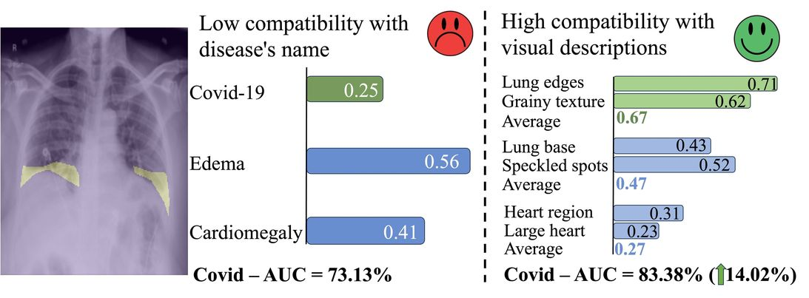

# CVPR2024 - Decomposing Disease Descriptions for Enhanced Pathology Detection: A Multi-Aspect Vision-Language Pre-training Framework

## Introduction

Welcome to the official implementation code for "Decomposing Disease Descriptions for Enhanced Pathology Detection: A Multi-Aspect Vision-Language Matching Framework", accepted at CVPR2024 🎉

[**Arxiv Version**](https://arxiv.org/abs/2403.07636)

This work leverages LLM 🤖 to decompose disease descriptions into a set of visual aspects. Our visual aspect vision-language pre-training framework, dubbed MAVL, achieves the state-of-the-art performance across 7 datasets for zero-shot and low-shot fine-tuning settings for disease classification and segmentation.



## 📝 Citation

If you find our work useful, please cite our paper.

```
@article{phan2024decomposing,
    title={Decomposing Disease Descriptions for Enhanced Pathology Detection: A Multi-Aspect  Vision-Language Pre-training Framework}, 
    author={Vu Minh Hieu Phan and Yutong Xie and Yuankai Qi and Lingqiao Liu and Liyang Liu and Bowen Zhang and Zhibin Liao and Qi Wu and Minh-Son To and Johan W. Verjans},
    year={2024},
    journal={arXiv preprint arXiv:2403.07636},
}

```
<h2>Comparisons with SOTA image-text pre-training models under zero-shot classification on 5 datasets.</h2>

<table>
<thead>
<tr>
    <th>Dataset</th>
    <th colspan="3"><strong>CheXpert</strong></th>
    <th colspan="3"><strong>ChestXray-14</strong></th>
    <th colspan="3"><strong>PadChest-seen</strong></th>
    <th colspan="3"><strong>RSNA Pneumonia</strong></th>
    <th colspan="3"><strong>SIIM-ACR</strong></th>
</tr>
<th> Method </th>
<th style="width: 250px;">AUC </th>
<th style="width: 250px;">F1 </th>
<th style="width: 250px;">ACC </th>
<th style="width: 250px;">AUC </th>
<th style="width: 250px;">F1 </th>
<th style="width: 250px;">ACC </th>
<th style="width: 250px;">AUC </th>
<th style="width: 250px;">F1 </th>
<th style="width: 250px;">ACC </th>
<th style="width: 250px;">AUC </th>
<th style="width: 250px;">F1 </th>
<th style="width: 250px;">ACC </th>
<th style="width: 250px;">AUC </th>
<th style="width: 250px;">F1 </th>
<th style="width: 250px;">ACC </th>
</tr>
</thead>
<tbody>
<tr>
<td>ConVIRT</td>
<td>52.10</td>
<td>35.61</td>
<td>57.43</td>
<td>53.15</td>
<td>12.38</td>
<td>57.88</td>
<td>63.72</td>
<td>14.56</td>
<td>73.47</td>
<td>79.21</td>
<td>55.67</td>
<td>75.08</td>
<td>64.25</td>
<td>42.87</td>
<td>53.42</td>
</tr>
<tr>
<td>GLoRIA</td>
<td>54.84</td>
<td>37.86</td>
<td>60.70</td>
<td>55.92</td>
<td>14.20</td>
<td>59.47</td>
<td>64.09</td>
<td>14.83</td>
<td>73.86</td>
<td>70.37</td>
<td>48.19</td>
<td>70.54</td>
<td>54.71</td>
<td>40.39</td>
<td>47.15</td>
</tr>
<tr>
<td>BioViL</td>
<td>60.01</td>
<td>42.10</td>
<td>66.13</td>
<td>57.82</td>
<td>15.64</td>
<td>61.33</td>
<td>60.35</td>
<td>10.63</td>
<td>70.48</td>
<td>84.12</td>
<td>54.59</td>
<td>74.43</td>
<td>70.28</td>
<td>46.45</td>
<td>68.22</td>
</tr>
<tr>
<td>BioViL-T</td>
<td>70.93</td>
<td>47.21</td>
<td>69.96</td>
<td>60.43</td>
<td>17.29</td>
<td>62.12</td>
<td>65.78</td>
<td>15.37</td>
<td>77.52</td>
<td>86.03</td>
<td>62.56</td>
<td>80.04</td>
<td>75.56</td>
<td>60.18</td>
<td>73.72</td>
</tr>
<tr>
<td>CheXzero</td>
<td>87.90</td>
<td>61.90</td>
<td>81.17</td>
<td>66.99</td>
<td>21.99</td>
<td>65.38</td>
<td>73.24</td>
<td>19.53</td>
<td>83.49</td>
<td>85.13</td>
<td>61.49</td>
<td>78.34</td>
<td>84.60</td>
<td>65.97</td>
<td>77.34</td>
</tr>
<tr>
<td>MedKLIP</td>
<td>87.97</td>
<td>63.67</td>
<td>84.32</td>
<td>72.33</td>
<td>24.18</td>
<td>79.40</td>
<td>77.87</td>
<td>26.63</td>
<td>92.44</td>
<td>85.94</td>
<td>62.57</td>
<td>79.97</td>
<td>89.79</td>
<td>72.73</td>
<td>83.99</td>
</tr>
<tr>
<td><strong>MAVL (Proposed)</strong></td>
<td><strong>90.13</strong></td>
<td><strong>65.47</strong></td>
<td><strong>86.44</strong></td>
<td><strong>73.57</strong></td>
<td><strong>26.25</strong></td>
<td><strong>82.77</strong></td>
<td><strong>78.79</strong></td>
<td><strong>28.48</strong></td>
<td><strong>92.56</strong></td>
<td><strong>86.31</strong></td>
<td><strong>65.26</strong></td>
<td><strong>81.28</strong></td>
<td><strong>92.04</strong></td>
<td><strong>77.95</strong></td>
<td><strong>87.14</strong></td>
</tr>
</tbody>
</table>


## 💡 Download Necessary Files
To get started, install the gdown library:
```bash
pip install -U --no-cache-dir gdown --pre
```

Then, run ```bash download.sh```

The MIMIC-CXR2 needs to be downloaded from [physionet](https://physionet.org/content/mimic-cxr-jpg/2.0.0/).

## 🚀 Library Installation
We have pushed the docker image with necessary environments.
You can directly create a docker container using our docker image:
```
docker pull stevephan46/mavl:latest
docker run --runtime=nvidia --name mavl -it -v /your/data/root/folder:/data --shm-size=4g stevephan46/mavl:latest
```
You may need to reinstall opencv-python, as there is some conflicting problem with the docker environment  `pip install opencv-python==4.2.0.32`


If you prefer manual installation over docker, please run the following installation:
```
pip install -r requirements.txt
pip install torch==1.12.0+cu113 torchvision==0.13.0+cu113 torchaudio==0.12.0 --extra-index-url https://download.pytorch.org/whl/cu113
pip install opencv-python==4.2.0.32
```

## 🤖 LLM Disease's Visual Concept Generation

The script to generate diseases' visual aspects using LLM - GPT can be found [here](Pretrain/concept_gen/concept_init.ipynb).

## 🔥 Pre-train:

<!-- Pre-train code will be released soon. Stay tuned. -->

Our pre-train code is given in ```Pretrain```. 
* Run download.sh to download necessary files
* Modify the path in config file configs/MAVL_resnet.yaml, and ```python train_mavl.py``` to pre-train.

* Run `accelerate launch --multi_gpu --num_processes=4 --num_machines=1 --num_cpu_threads_per_process=8 train_MAVL.py --root /data/2019.MIMIC-CXR-JPG/2.0.0 --config configs/MAVL_resnet.yaml --bs 124 --num_workers 8`

Note: The reported results in our paper are obtained by pre-training on 4 x A100 for 60 epochs. We provided the checkpoints [here](Pretrain/data_file/DATA_Prepare.md). We found that ckpts at later stage (`checkpoint_full_46.pth`) yields higher zero-shot classification accuracy. Ckpt at earlier stage (`checkpoint_full_40.pth`) yields more stable accuracy on visual grounding.

We also conducted a lighter pre-training schedule with 2 x A100 for 40 epochs using mixed precision training, achieving similar zero-shot classification results. Checkpoint for this setup is also available [here](Pretrain/data_file/DATA_Prepare.md).

```
accelerate launch --multi_gpu --num_processes=2 --num_machines=1 --num_cpu_threads_per_process=8 --mixed_precision=fp16 train_MAVL.py --root /data/2019.MIMIC-CXR-JPG/2.0.0 --config configs/MAVL_short.yaml --bs 124 --num_workers 8
```

## 📦 Downstream datasets:
Links to download downstream datasets are:
* [CheXpert](https://stanfordaimi.azurewebsites.net/datasets/8cbd9ed4-2eb9-4565-affc-111cf4f7ebe2).
* [ChestXray-14](https://nihcc.app.box.com/v/ChestXray-NIHCC/folder/36938765345).
* [PadChest](https://bimcv.cipf.es/bimcv-projects/padchest/).
* [RSNA](https://www.rsna.org/rsnai/ai-image-challenge/rsna-pneumonia-detection-challenge-2018) - Download images from initial annotations.
* [SIIM](https://www.kaggle.com/c/siim-acr-pneumothorax-segmentation/data?select=download_images.py).
* COVIDx-CXR-2 - The [official link](https://github.com/lindawangg/COVID-Net/blob/master/docs/COVIDx.md) on Kaggle is down. The publicly available expanded version, called COVIDx-CXR4 is released [here](https://www.kaggle.com/datasets/andyczhao/covidx-cxr2). They encompass COVIDx-CXR-2 as subset. Please use our dataset csv splits to reproduce the results on COVIDx-CXR-2 subset version.
* Covid Rural - The [official link](https://wiki.cancerimagingarchive.net/pages/viewpage.action?pageId=70226443) includes raw DICOM datasets. We use preprocessed data provided [here](https://github.com/haimingt/opacity_segmentation_covid_chest_X_ray/tree/master/covid_rural_annot).

## 🌟 Quick Start:
Check this [link](Pretrain/data_file/DATA_Prepare.md) to download MAVL checkpoints. It can be used for all zero-shot && finetuning tasks 

* **Zero-Shot Classification:**
    
    We give examples in ```Sample_Zero-Shot_Classification```. Modify the path, and test our model by ```python test.py --config configs/dataset_name_mavl.yaml```
* **Zero-Shot Grounding:**
    
    We give examples in ```Sample_Zero-Shot_Grounding```. Modify the path, and test our model by ```python test.py```
* **Finetuning:**
    
    We give segmentation and classification finetune code on in ```Sample_Finetuning_SIIMACR```. Modify the path, and finetune our model by ```python I1_classification/train_res_ft.py --config configs/dataset_name_mavl.yaml``` or ```python I2_segementation/train_res_ft.py --config configs/dataset_name_mavl.yaml```


## 🙏 Acknowledgement
Our code is built upon https://github.com/MediaBrain-SJTU/MedKLIP. We thank the authors for open-sourcing their code.

Feel free to reach out if you have any questions or need further assistance!
